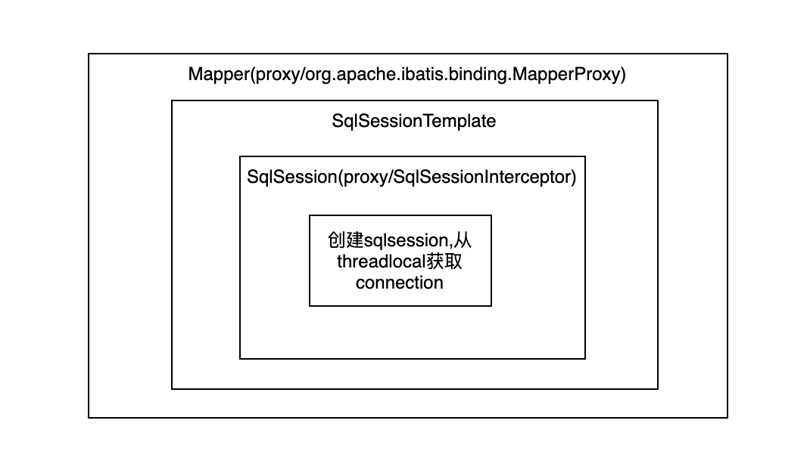

# 1.mybatis的sqlsession模型
* 我们知道，在spring中配置FactoryBean,实际上会调用其getObject方法注册到spring容器中，
* 我们使用mybatis一般会使用MapperScannerConfigurer扫码指定包下的Mapper接口,生成MapperFactoryBean,所以我们在service中注入的dao一般就是MapperFactoryBean#getObject()的返回值。
* 返回的代理如下:

2.多数据源
在项目中使用了2个datasource,因此使用了ChainedTransactionManager代理多个DataSourceTransactionManager。
对于代理的每个事务管理器都开启事务