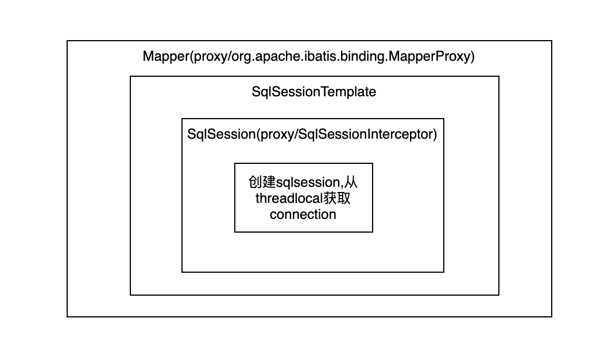
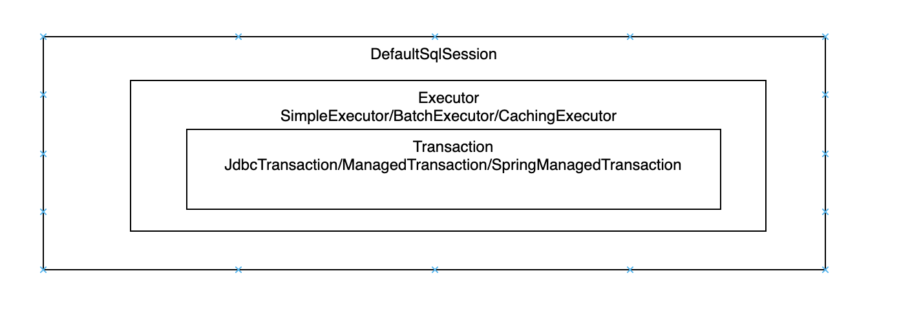

# 从SqlSessionTemplate说起
* SqlSessionTemplate内部有一个sqlSessionProxy，当调用insert,update,getConnection等方法的时候，实际上是调用了代理类，sqlSessionProxy是由动态代理生成的，对应的InvocationHandler是SqlSessionInterceptor，他会从threadlocal（TransactionSynchronizationManager）中获取sqlSession，如果不存在使用sqlSessionFactory创建sqlsession，也就是说在SqlSessionInterceptor中获得了sqlsession，由此从spring的封装进入了原生的mybatis。
* 我的理解是SqlSessionTemplate+SqlSessionInterceptor 实际上做了一个代理，实际上还是调用sqlsession，单线程可以重复利用。
* 不论是defaultSqlsession还是SqlSessionTemplate，它们的getMapper方法都会创建代理，并且把自己this传进去，以后调用代理类的方法的时候本质上还是会调用这个this的方法。返回的代理类就是注入的mapper，这个mapper有一个成员MapperProxy，它实现了InvocationHandler。
* 所以调用一个mapper方法的时候，先后顺序是

* mapper（代理类） -> MapperProxy -> 。。。 - >SqlSessionTemplate(被代理类) -> sqlSessionProxy(代理类) -> SqlSessionInterceptor -> DefaultSqlSession(被代理类)
* 其中。。。表示还有一些其他步骤
* MapperProxy#invoke 方法会先根据method创建MapperMethod缓存起来，然后调用其execute方法，然后到SqlSessionTemplate。
* 接下来调用defaultSqlsession的方法，从configuration中得到MappedStatement，然后使用executor，
* executor获取StatementHandler（RoutingStatementHandler），使用prepareStatement方法预编译sql，例如connection.prepareStatement等等，然后调用parameterize方法，使用parameterHandler设置参数，
* 然后查询，然后使用ResultSetHandler封装结果返回。

# 懒加载
* 原理无非是 如果是非懒加载的 构造resultmap返回 设为A
* 如果是懒加载的，相比之前的结果A做一个代理，之后调用方法如果是延迟加载的属性，则会拦截方法处理
* 此配置也需要在setting中配置


# spring整合mybatis sqlSession释放问题
* MapperFactoryBean实现了FactoryBean，所以
* MapperFactoryBean.getObject -> SqlSessionTemplate.getMapper() -> Configuration.getMapper() -> MapperRegistry.getMapper() ->
* mapperProxyFactory.newInstance(sqlSession);
* 最后用jdk动态代理生成了代理类，代理的接口是MapperProxyFactory的mapperInterface（就是Mapper），InvocationHandler是MapperProxy。


```
public Object invoke(Object proxy, Method method, Object[] args) throws Throwable {
    if(Object.class.equals(method.getDeclaringClass())) {
        try {
            return method.invoke(this, args);
        } catch (Throwable var5) {
            throw ExceptionUtil.unwrapThrowable(var5);
        }
   } else {
        MapperMethod mapperMethod = this.cachedMapperMethod(method);
        return mapperMethod.execute(this.sqlSession, args);
    }
}
```
* invoke调用了sqlSession，这个sqlSession实际上是SqlSessionTemplate。这个template的构造函数
```
public SqlSessionTemplate(SqlSessionFactory sqlSessionFactory, ExecutorType executorType,
                            PersistenceExceptionTranslator exceptionTranslator) {
    notNull(sqlSessionFactory, "Property 'sqlSessionFactory' is required");
    notNull(executorType, "Property 'executorType' is required");
    
    this.sqlSessionFactory = sqlSessionFactory;
    this.executorType = executorType;
    this.exceptionTranslator = exceptionTranslator;
    this.sqlSessionProxy = (SqlSession) newProxyInstance(
    SqlSessionFactory.class.getClassLoader(),
    new Class[] { SqlSession.class },
    new SqlSessionInterceptor());
}
```
* 也初始化了一个代理sqlSessionProxy ，每次查询或者删除都是使用这个代理类的方法


```
public <T> T selectOne(String statement) {
    return this.sqlSessionProxy.<T> selectOne(statement);
}
```

* 这个代理类使用了SqlSessionInterceptor，SqlSessionInterceptor会尝试获取当前线程的sqlsession,如果没有就使用sqlsessionfactory创建。
```
private class SqlSessionInterceptor implements InvocationHandler {
    @Override
    public Object invoke(Object proxy, Method method, Object[] args) throws Throwable {
            SqlSession sqlSession = getSqlSession(
            SqlSessionTemplate.this.sqlSessionFactory,
            SqlSessionTemplate.this.executorType,
            SqlSessionTemplate.this.exceptionTranslator);
            try {
                Object result = method.invoke(sqlSession, args);
                if (!isSqlSessionTransactional(sqlSession, SqlSessionTemplate.this.sqlSessionFactory)) {
                    // force commit even on non-dirty sessions because some databases require
                    // a commit/rollback before calling close()
                    sqlSession.commit(true);
                }
                return result;
            } catch (Throwable t) {
                Throwable unwrapped = unwrapThrowable(t);
                if (SqlSessionTemplate.this.exceptionTranslator != null && unwrapped instanceof PersistenceException) {
                    // release the connection to avoid a deadlock if the translator is no loaded. See issue #22
                    closeSqlSession(sqlSession, SqlSessionTemplate.this.sqlSessionFactory);
                    sqlSession = null;
                    Throwable translated = SqlSessionTemplate.this.exceptionTranslator.translateExceptionIfPossible((PersistenceException) unwrapped);
                    if (translated != null) {
                        unwrapped = translated;
                    }
                }
                throw unwrapped;
            } finally {
                if (sqlSession != null) {
                    closeSqlSession(sqlSession, SqlSessionTemplate.this.sqlSessionFactory);
                }
            }
        }
    }
```
* 完成了每次请求sqlSession的获取和释放。
* 也就是我们写的dao最后一个代理，每次涉及数据库操作时会调用SqlSessionTemplate，SqlSessionTemplate也有一个代理类，在在代理类里面获取sqlsession，然后发生实际的操作。

# mybatis的sqlsession模型
* 我们知道，在spring中配置FactoryBean,实际上会调用其getObject方法注册到spring容器中，
* 我们使用mybatis一般会使用MapperScannerConfigurer扫码指定包下的Mapper接口,生成MapperFactoryBean,所以我们在service中注入的dao一般就是MapperFactoryBean#getObject()的返回值。
* 返回的代理如下:
  

# 多数据源
* 在项目中使用了2个datasource,因此使用了ChainedTransactionManager代理多个DataSourceTransactionManager。
* 对于代理的每个事务管理器都开启事务
```
try {
    for (PlatformTransactionManager transactionManager : transactionManagers) {
        mts.registerTransactionManager(definition, transactionManager);
    }
}
public void registerTransactionManager(TransactionDefinition definition, PlatformTransactionManager transactionManager) {
    getTransactionStatuses().put(transactionManager, transactionManager.getTransaction(definition));
}
```
* 每个事务管理器都包含不同的datasource, 对带有@Transactional注解的方法,进入切面时需要开启新事务的时候会从datasource中获取一个connection, 然后放到threadlocal中。
```
if (txObject.isNewConnectionHolder()) {
    TransactionSynchronizationManager.bindResource(getDataSource(), txObject.getConnectionHolder());
}
```

# mybatis获取threadLocal中的connection。
* sqlsession和connection的关系
  
* 之前说到mybatis创建sqlSession是在SqlSessionInterceptor中,该类实现了InvocationHandler。
```
private class SqlSessionInterceptor implements InvocationHandler {
  @Override
  public Object invoke(Object proxy, Method method, Object[] args) throws Throwable {
    SqlSession sqlSession = getSqlSession(SqlSessionTemplate.this.sqlSessionFactory,
        SqlSessionTemplate.this.executorType, SqlSessionTemplate.this.exceptionTranslator);
    try {
      Object result = method.invoke(sqlSession, args);
      if (!isSqlSessionTransactional(sqlSession, SqlSessionTemplate.this.sqlSessionFactory)) {
        // force commit even on non-dirty sessions because some databases require
        // a commit/rollback before calling close()
        sqlSession.commit(true);
      }
      return result;
    } catch (Throwable t) {
      Throwable unwrapped = unwrapThrowable(t);
      if (SqlSessionTemplate.this.exceptionTranslator != null && unwrapped instanceof PersistenceException) {
        // release the connection to avoid a deadlock if the translator is no loaded. See issue #22
        closeSqlSession(sqlSession, SqlSessionTemplate.this.sqlSessionFactory);
        sqlSession = null;
        Throwable translated = SqlSessionTemplate.this.exceptionTranslator
            .translateExceptionIfPossible((PersistenceException) unwrapped);
        if (translated != null) {
          unwrapped = translated;
        }
      }
      throw unwrapped;
    } finally {
      if (sqlSession != null) {
        closeSqlSession(sqlSession, SqlSessionTemplate.this.sqlSessionFactory);
      }
    }
  }
}
```
* 一路追踪下去,发现最后使用的transaction的实现类是SpringManagedTransaction,从threadlocal中获取连接, 保存时和获取时的key都是datasource,从而保证不同的sqlsessionfactory获取正确的连接。
* 所以如果事务管理器和sqlsessionfactory对应的datasource不一致，将获取不到对应的连接, 导致事务无法回滚的问题。
```
private void openConnection() throws SQLException {
    this.connection = DataSourceUtils.getConnection(this.dataSource);
    this.autoCommit = this.connection.getAutoCommit();
    this.isConnectionTransactional = DataSourceUtils.isConnectionTransactional(this.connection, this.dataSource);
 
    LOGGER.debug(() -> "JDBC Connection [" + this.connection + "] will"
        + (this.isConnectionTransactional ? " " : " not ") + "be managed by Spring");
}
```
* 最后事务提交，将所有threadlocal中不同数据源的connection commit或者rollback。