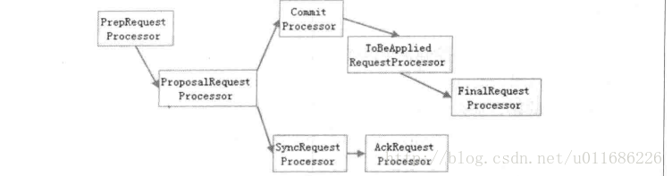

# FastLeaderElection选举分析
* FastLeaderElection 是zookeeper默认的选举算法
* FastLeaderElection有2个队列，
* LinkedBlockingQueue<ToSend> sendqueue;
* LinkedBlockingQueue<Notification> recvqueue;
* 分别代表发送到其他节点的投票信息和接收到其他节点的投票信息。
* lookForLeader
* 实例化了2个hashmap
* HashMap<Long, Vote> recvset = new HashMap<Long, Vote>();
* HashMap<Long, Vote> outofelection = new HashMap<Long, Vote>();
* 分别代表所有节点发送过来的投票和following，leading状态的节点发过来的投票

```
synchronized(this){
    logicalclock++;
    updateProposal(getInitId(), getInitLastLoggedZxid(), getPeerEpoch());
}
```
* logicalclock是逻辑时钟，逻辑时钟下面会有介绍。
* updateProposal方法更新本地节点的投票，意思就是代表当前节点推荐的leader的id，这个推荐leader的zxid，这个推荐leader的epoch。第一次是推荐自己，
* 所以getinitid方法会判断当前节点是否是PARTICIPANT状态，如果不是PARTICIPANT状态而是OBSERVER状态，说明不参与选举，返回的id是Long.MIN_VALUE，选举的时候回选
* 择id较大的（当然还需要判断其他信息）。
* 然后调用sendNotifications();将刚刚的投票广播到所有其他的PARTICIPANT节点，先放进sendqueue阻塞队列中。

```
while ((self.getPeerState() == ServerState.LOOKING) &&
(!stop)){
```
* 接下来是一直循环到选出leader
* 然后从recvqueue获取一个投票信息Notification，
* 1 如果这个Notification的逻辑时钟大于当前的逻辑时钟，
  * 说明有新一轮的投票，之前的过期了，将当前的逻辑时钟设置为这个Notification的时钟，然后清除recvset。
  * 然后调用totalOrderPredicate方法，判断2张选票的大小，就是判断本地节点和recvqueue的选票。
   ```
   if(self.getQuorumVerifier().getWeight(newId) == 0){
   return false;
   }
   
   /*
   * We return true if one of the following three cases hold:
   * 1- New epoch is higher
   * 2- New epoch is the same as current epoch, but new zxid is higher
   * 3- New epoch is the same as current epoch, new zxid is the same
   *  as current zxid, but server id is higher.
      */
   
   return ((newEpoch > curEpoch) ||
   ((newEpoch == curEpoch) &&
   ((newZxid > curZxid) || ((newZxid == curZxid) && (newId > curId)))));
   ```
  * 先判断逻辑时钟，谁的时钟大，选票就大。在判断事务号，然后是节点id。
  * 然后用updateProposal更新本地节点的投票，在调u用sendNotifications方法广播自己推荐的leader。

* 2 如果这个Notification的逻辑时钟大于当前的逻辑时钟
  * 不处理
* 接下来会把这个Notification放到recvsethashmap中，

# zookeeper请求处理链

 
* leader
* ProposalRequestProcessor
* 他有两个后续的处理器，CommitProcessor（默认）和syncProcessor
* 如果是LearnerSyncRequest就直接处理掉
* 否则先让commitProcessor处理，如果是事务请求，还要提议，集群投票，然后再让syncProcessor处理
* 也就是说，“经过了syncProcessor”处理的请求一定经过了"commitProcessor"的处理

* SyncRequestProcessor
* 记录事务日志 请求转发至下一processor

* AckRequestProcessor
* 是leader端的处理器
* 负责在SyncRequestProcessor完成事务日志记录后，向Proposal的投票收集器发送ACK反馈，以通知投票收集器当前服务器已经完成了对该Proposal的事务日志记录。本质是调用leader.processAck方法，这个方法会将确认结果扔往

* CommitProcessor
* 事务提交处理器。对于非事务请求，该处理器会直接将其交付给下一级处理器处理；对于事务请求，其会等待集群内针对Proposal的投票直到该Proposal可被提交，利用CommitProcessor，每个服务器都可以很好地控制对事务请求的顺序处理。

* ToBeAppliedRequestProcessor
* 除了CommitProcessor过来的请求，还会处理AckRequestProcessor 中leadert扔往oBeApplied队列的数据
